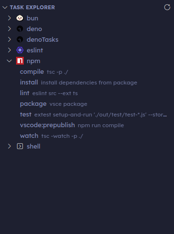

# vscode-task-explorer

> Upgraded Task Explorer GUI.

> Inspired by [spmeesseman/vscode-taskexplorer](https://github.com/spmeesseman/vscode-taskexplorer)

Provides a view in the explorer for running tasks directly.

## License

[MIT](./LICENSE)

## Acknowledgements

- Logo generated using [IconKitchen](https://icon.kitchen/i/H4sIAAAAAAAAAzWOwQ6CMBBE%2F2XOjVFAUK7GL5CbMWahWyAUQdqCCeHfbU087WZ2Z96smEk7NshXSJq6ouGekSvShgVUfdHtSJMNZ8N%2BQLIipy0E2mp4ecGS6Z7klU2grAv%2BWDf5hBX2v2Kh2ROET2CJfL9Lj8khzs5JlsVRGp3Sn%2FPW0BiezduRdwX4VSmurO8G05AcloDoB%2Bl06HvHwiUe2xcJkXCQwgAAAA%3D%3D)
